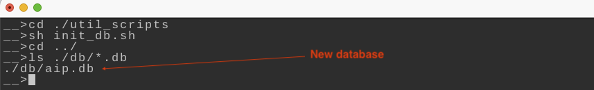
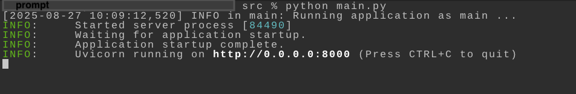
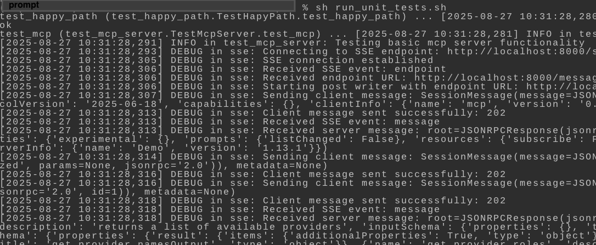
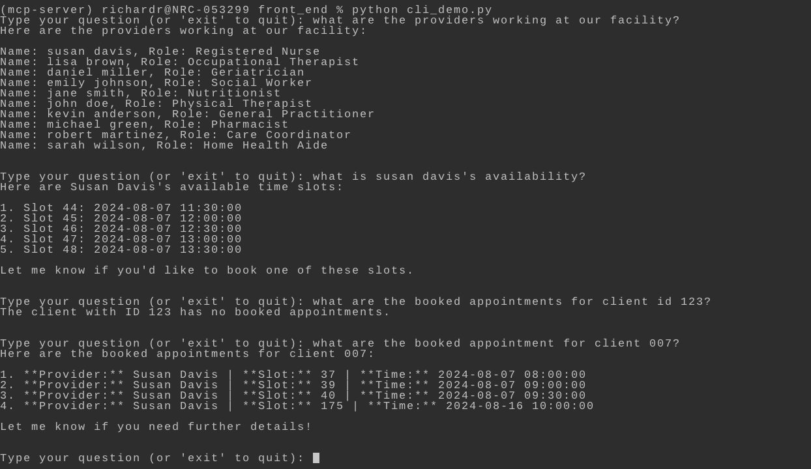
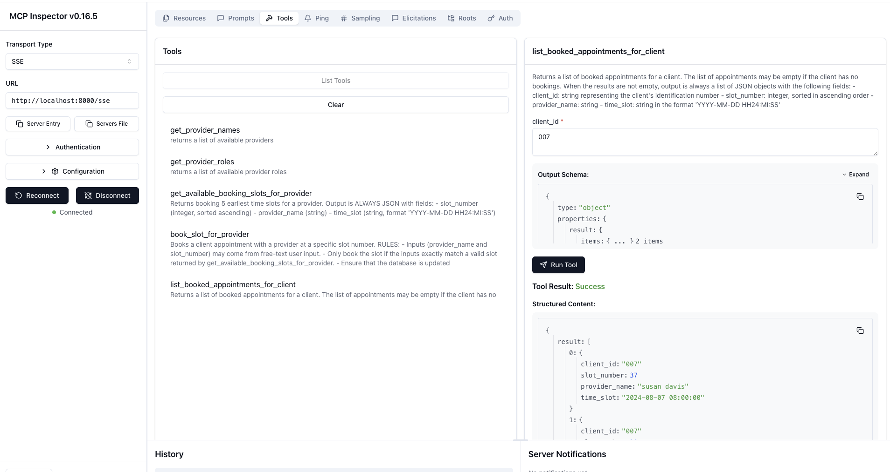

# Purpose

- MCP server used to share tools, prompts and resources
- Available tools :
   - `cancel_booked_appointment_for_client` - Cancels a client appointment with a provider at a specific slot number
   - `get_provider_names` - returns a list of available providers
   - `get_provider_roles` - returns a list of available provider roles
   - `get_available_booking_slots_for_provider` - returns a list of available / open provider time slots
   - `book_slot_for_provider` - books client appoinment with provider at specified time slot
   - `list_booked_appointments_for_client` - Returns a list of booked appointments for a client
- Available prompts :
   - `configure_assistant`

# General Setup and Usage Instructions

The instructions assume that you are in the `<project root>/mcp` directory.
They have been tested and validate on a Mac M2.

---

- (REQUIRED) - Setting up the sqlite3 database - (Assumes sqlite3 is already installed as is the case on a Mac.)
~~~
<new terminal window>
cd ./util_scripts
sh init_db.sh
~~~
- This will create and populate the database (the database file is : `<project root>/mcp/db/aip.db`). Only run this once.
- When the databaes is ready, you should see something like this in your terminal :

---

- (OPTIONAL) - There is a `cli.sh` file in the `./util_scripts` directory that can be used to connect to the database using the command-line interface
- Running the command-line interface is optional
- When run, you can issue SQL queries interactively
- If the `cli.sh` script is run, you should see something like this in your terminal:

- To reset the database, delete the `<project root>/mcp/db/aip.db` file and re-run the database setup step.

---

- (REQUIRED) - Run following commands to setup the conda environment with python 3.13.3
~~~
<new terminal window>
cd ./src
conda create -n mcp-server python=3.13.3
conda activate mcp-server
pip install -r requirements.txt
pip install aiosqlite
~~~

---

- (REQUIRED) - Start the MCP server
~~~
<new terminal window>
cd ./src/back_end
python mcp_server.py
~~~
- When the MCP server script is run, you should see something like this in your terminal:

---

- (OPTIONAL) - If you want to test the mcp server with Jupyter
- The Jupyter notebook is helpful when learning how to interact with the MCP server. 
   - See [./src/jupyter/mcp_test.ipynb](./src/jupyter/mcp_test.ipynb) and [./src/jupyter/simple_graph.ipynb](./src/jupyter/simple_graph.ipynb) for details on how to interact with the MCP server.
~~~
<new terminal window>
cd ./src
conda activate mcp-server
jupyter notebook
~~~
- Notebooks will be located in the `./jupyter` directory

---

- (OPTIONAL) - If you want to run the unit tests,
- Note that the MCP server must be running and the datbase must exist for the tests to pass
~~~
<new terminal window>
conda activate mcp-server
cd ./util_scripts
sh run_unit_tests.sh
~~~
- When running the unit tests, your terminal should look like this:

- The tests should all succeed. It is best to re-initialize the database prior to running the tests.

---

- (OPTIONAL) -  If you want to run the command-line chat interface:
~~~
<new terminal window>
conda activate mcp-server
cd ./src/front_end/
python cli_demo.py
~~~
- When running the command-line interface your terminal should look like this:

- Note that the MCP server needs to be running for the chat client to work

---

- (OPTIONAL) - If you want to run the MCP inspector:
~~~
<new terminal window>
conda activate mcp-server
cd ./util_scripts
sh start_inpector.sh
~~~
- The GUI for the inspector should look like this:

- Note that the MCP server must be running and the database must exit in order to interact with the tools using the inspector

- Note that the inspector needs `npm` and `nodejs`. These can be installed with brew.
