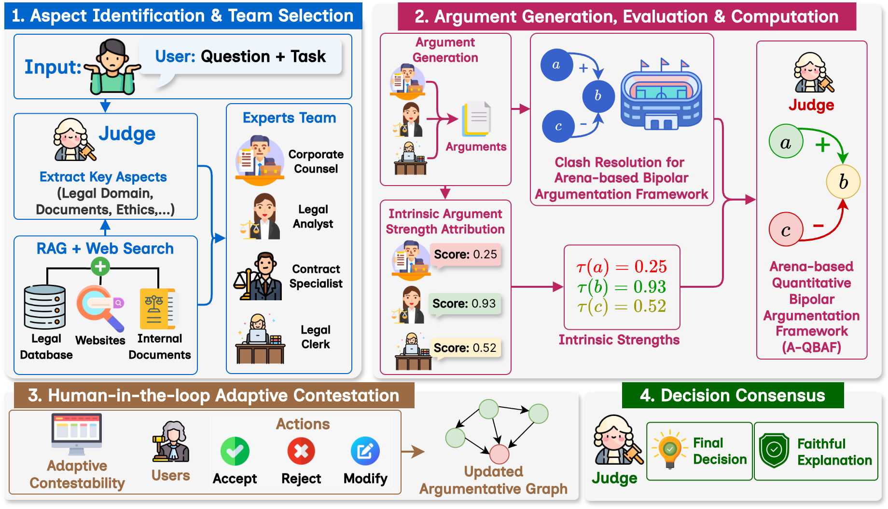

# Adaptive Collaboration of Argumentative LLMs for Explainable and Contestable Legal Reasoning


This repository contains the official implementation and evaluation code for the paper:

> **Adaptive Collaboration of Argumentative LLMs for Explainable and Contestable Legal Reasoning**

---

## Overview


## Installation
### Create environment
We recommend using conda to set up the environment.

```
conda create -n env python=3.11
conda activate env
pip install -r requirements.txt
```
### API Configuration

Create a .env file in the root directory and configure the required API keys.
```
# Gemini API
GOOGLE_API_KEY="YOUR_GOOGLE_API_KEY"

# Azure OpenAI (for RAG setup)
AZURE_API_KEY=""
AZURE_ENDPOINT=""
```

### ⚠️ Important:
Do NOT commit your .env file or API keys to the repository.

## Running the Framework

To run the main experimental pipeline:
```
python main.py
```
### Customization and Extensions

**Ablation Studies**

- You can modify the `base_adjustment parameter` in `qbaf_scorer.py` to perform ablation studies on the argument strength adjustment mechanism.

**Prompt Engineering**

- Agent prompts are defined in node.py.

- The current implementation supports two legal reasoning tasks used in the paper.

- You can extend the framework to other legal tasks by defining new prompts and agent roles.