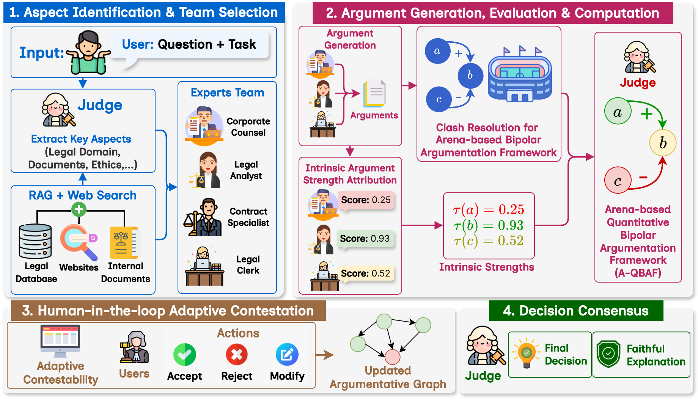

# ACAL

<p align="center">
  <b>Adaptive Collaboration of Arena-Based Argumentative LLMs</b><br>
  <i>for Explainable and Contestable Legal Reasoning</i>
</p>

<p align="center">
  <a href="https://arxiv.org/pdf/2602.18916">
    
  </a>
  
  
</p>

---

## About

This repository contains the official implementation of our **Canadian AI 2026** paper:

> **Adaptive Collaboration of Arena-Based Argumentative LLMs for Explainable and Contestable Legal Reasoning**

Preprint version: [[Paper](https://arxiv.org/pdf/2602.18916)]

---

## Overview

<p align="center">
  
</p>

---

## Installation

### Create Environment

We recommend using `conda` to set up the environment.

```bash
conda create -n env python=3.11
conda activate env
pip install -r requirements.txt
````

---

### API Configuration

Create a `.env` file in the root directory and configure the required API keys.

```bash
# Gemini API
GOOGLE_API_KEY="YOUR_GOOGLE_API_KEY"

# Azure OpenAI for RAG setup
AZURE_API_KEY=""
AZURE_ENDPOINT=""
```

> [!WARNING]
> Do **not** commit your `.env` file or API keys to the repository.

---

## Running the Framework

To run the main experimental pipeline:

```bash
python main.py
```

---

## Customization and Extensions

### Ablation Studies

You can modify the `base_adjustment` parameter in `qbaf_scorer.py` to perform ablation studies on the argument strength adjustment mechanism.

---

### Prompt Engineering

Agent prompts are defined in `node.py`.

The current implementation supports two legal reasoning tasks used in the paper.

You can extend the framework to other legal tasks by defining new prompts and agent roles.

---

<p align="center">
  <i>Official implementation for Canadian AI 2026.</i>
</p>

